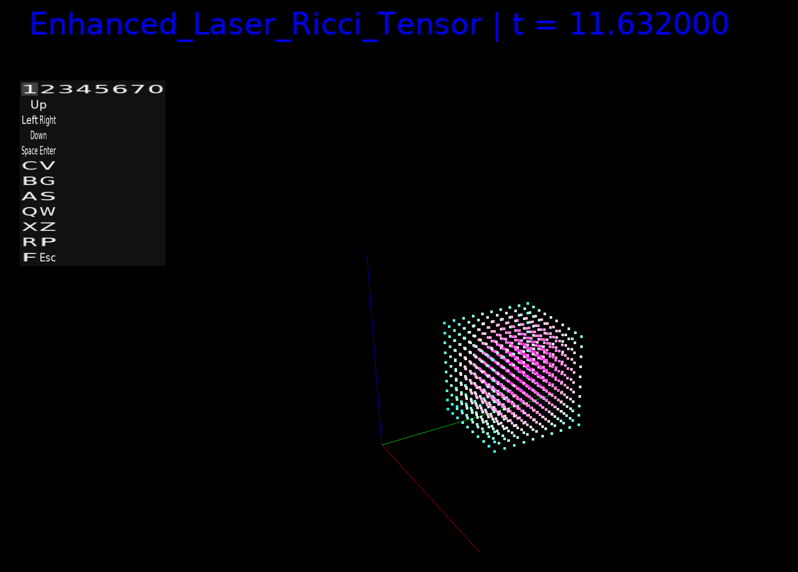

 
 
If you have issues it is probably in log.txt so it may help you along the way. 
I am a computer nerd and geek and wanted to check out something I figured out along the way so I worked with AI to make this. 
I am interested if this is useful to anyone and let me know if there are issues. If you try it and it makes sense or maybe it is broken then feel free to drop me a line by opening a ticket. 
I think there are some small issues yet with parsing some equations as I want better parsing for more structures.  
 
It is easiest to paste your equation into AI along with equations.txt and ask it to make your equation compatable, rather than scratch your head. 
 
If anyone thinks this is cool or useful, let me know and I might make a decent manual, for now you should probably just bookmark it or download README.md and get something that reads markdown like VSCode or one of the various other readers.
  
Current license is feel free to use and modify, even commercial business. If you redistribute it, it needs to have the same license and is not for sale. 
If I misinterpret the license in that regard, then this is in addition to the current license.  
I have mental health issues, so if you think this is useful to you, go ahead and create fork. I sometimes delete things.  

# Simulator Manual
  
# Overview
 
The Simulator is a powerful, open-source computational tool designed for physicists, mathematicians, and computational scientists to model and visualize complex physical systems in three-dimensional (3D) and four-dimensional (4D) spaces. Developed using C++, SDL2, OpenGL, and SDL_ttf, the Simulator provides a robust platform for simulating particle-based and grid-based physical phenomena governed by user-defined equations. It supports real-time rendering in multiple visualization modes, including point clouds, isosurfaces, wireframes, particle trajectories, hybrid displays, and 2D surfaces, making it ideal for studying dynamical systems, field theories, and tensor-based physics.
  
The Simulator employs a modular architecture, enabling users to define custom equations through a mathematical expression parser or implement tensor-based equations for advanced field computations. It leverages OpenMP for parallel processing of large grids and particle systems. The visualization is highly interactive, with controls for camera manipulation, simulation parameters, and equation switching, all accessible via intuitive key bindings.  
This manual provides a comprehensive guide to the Simulator’s functionality, visualization modes, equation system, key bindings, and practical applications, tailored for users with a strong background in physics and mathematics.
  
System Requirements  
Operating System: Windows, Linux, or MacOS. Only Linux tested  

# Dependencies:  
SDL2 for windowing and input 
SDL2_ttf for font rendering 
OpenGL for display 
GLEW for OpenGL functionality 
OpenMP for parallel computation 
C++17-compliant compiler (e.g., GCC, MSVC, Clang) 
git (or click the green code button at the top and download as ZIP) 
cmake  

Hardware: 
OpenGL 2.1-compatible GPU 
Multi-core CPU (recommended for parallel computation) 
4 GB RAM or more  

Files: 
DejaVuSans.ttf font file (must be placed in the project directory or a system font path) 
equations.txt configuration file for custom equations 

# Installation  
Install Dependencies: 
Linux: `sudo apt-get install libsdl2-dev libsdl2-ttf-dev libglew-dev build-essential mesa-utils libglu1-mesa-dev freeglut3-dev mesa-common-dev` 
Windows: Use vcpkg or download SDL2, SDL2_ttf, and GLEW libraries 
macOS: Use Homebrew (brew install sdl2 sdl2_ttf glew) 

# Clone the Repository:
`git clone https://github.com/ZacGeurts/Simulator` 
`cd Simulator` 
 
Build the Project: 
Use CMake: 
`mkdir build` 
`cd build` 
`cmake ..` 
`make` 
 
Place DejaVuSans.ttf in the project root or build directory (../DejaVuSans.ttf relative to the executable). 

Ensure equations.txt is in the project directory. 

# Run the Program:
`./simulator`

# Program Functionality
The Simulator models physical systems by integrating user-defined equations over a 3D grid or a set of particles. The simulation state is managed by a Simulation object, which includes:
Grid Data:
ricci: 3D array of Tensor objects for Ricci curvature or similar tensor fields.

divergence: 3D array of Tensor objects for divergence or gradient fields.

scalar: 3D array of scalar values from equations.

computed_scalar: 3D array of computed scalar fields for visualization.

scalar_4d: 4D array for time-dependent or higher-dimensional scalar fields.

Particle Data:
particles: Vector of Particle objects with position (x, y, z), velocity (vx, vy, vz), and acceleration (ax, ay, az).

Simulation Parameters:
t: Current simulation time.

dt: Time step (default: 0.01).

size: Grid size (default: 20, adjustable 5–50).

dx: Grid spacing (default: 0.1).

current_equation: Index of the active equation.

equations: Vector of Equation objects defining the physics.

The simulation advances in real-time using a timer (16 ms interval, ~60 FPS), updating particle positions, grid fields, and rendering the scene. The rendering pipeline uses OpenGL with GLEW for vertex buffer objects (VBOs) and SDL_ttf for displaying the current equation name.
Visualization Modes
The Simulator supports six visualization modes, selectable via key bindings, each tailored to different aspects of the simulation data:  
 
I can be lazy. SDL_SCANCODE just means press the 1 or 2 or 3 key, etc. 
 
Points Mode (SDL_SCANCODE_1) 
Description: Renders the 3D grid as a point cloud, with each point colored based on its computed_scalar and scalar_4d values (at a time-dependent w_slice). 
 
Color Mapping: 
Red: Normalized computed_scalar. 
 
Green: Normalized scalar_4d scaled by 0.5. 
 
Blue: Inverse of computed_scalar scaled by 0.5. 
 
Use Case: Visualizes scalar field distributions (e.g., density, potential) across the grid. 
 
Mathematical Context: Represents ϕ(x,y,z,t)\phi(x, y, z, t)\phi(x, y, z, t) 
 and ϕ(x,y,z,w,t)\phi(x, y, z, w, t)\phi(x, y, z, w, t) 
 
 
Isosurface Mode (SDL_SCANCODE_2) 
Description: Uses Marching Cubes to render isosurfaces of computed_scalar at a dynamic isovalue \text{iso_level} = \min(\phi) + (\max(\phi) - \min(\phi)) \cdot (0.3 + 0.2 \sin(t)) 
 
Features: 
Colors from scalar_4d, with normals computed via finite differences for smooth lighting. 
 
Uses VBOs for efficient triangle mesh rendering. 
 
Use Case: Visualizes equipotential surfaces or density contours (e.g., gravitational fields, wave fronts). 
 
Mathematical Context: Displays level sets {(x,y,z)∣ϕ(x,y,z,t)=c}\{ (x, y, z) \mid \phi(x, y, z, t) = c \}\{ (x, y, z) \mid \phi(x, y, z, t) = c \} 
 
 
Wireframe Mode (SDL_SCANCODE_3) 
Description: Renders the grid as a wireframe, with lines connecting adjacent points. Line colors are based on computed_scalar and scalar_4d, with z-positions offset by the scalar value. 
 
Use Case: Highlights grid structure and scalar field gradients in sparse data. 
 
Mathematical Context: Visualizes grid connectivity and ϕ(x,y,z,t)\phi(x, y, z, t)\phi(x, y, z, t) 
 as z-perturbations 
 
 
Particles Mode (SDL_SCANCODE_4) 
Description: Renders particles as points with velocity trails. Colors are based on speed (vx2+vy2+vz2\sqrt{v_x^2 + v_y^2 + v_z^2}\sqrt{v_x^2 + v_y^2 + v_z^2} 
), with red proportional to speed, green fixed, and blue inversely proportional. 
 
Use Case: Tracks particle motion under forces (e.g., gravitational, electromagnetic). 
 
Mathematical Context: Shows phase space trajectories governed by a=f(x,v,t)\mathbf{a} = f(\mathbf{x}, \mathbf{v}, t)\mathbf{a} = f(\mathbf{x}, \mathbf{v}, t) 
 
 
Hybrid Mode (SDL_SCANCODE_5) 
Description: Combines Points and Particles modes, rendering both the grid-based scalar field and particle system. 
 
Use Case: Analyzes field-particle interactions (e.g., particles in a potential field). 
 
Mathematical Context: Visualizes ϕ(x,y,z,t)\phi(x, y, z, t)\phi(x, y, z, t) 
 and particle dynamics together 
 
 
Surface Mode (SDL_SCANCODE_6) 
Description: Renders a 2D surface in the x-y plane at z=size/2z = \text{size}/2z = \text{size}/2 
, with height proportional to computed_scalar. Colors are based on scalar_4d, with lighting for depth. 
 
Use Case: Studies 2D field slices (e.g., wave propagation, temperature distributions). 
 
Mathematical Context: Displays z=ϕ(x,y,z0,t)z = \phi(x, y, z_0, t)z = \phi(x, y, z_0, t) 
 with 4D color mapping 
 
 
Sphere Points Mode (SDL_SCANCODE_7) 
 
Description: Renders a semi-transparent sphere composed of large, colorful points representing the scalar field values within a spherical region. Points are larger and denser than in Points mode, with semi-transparency to enhance visibility of overlapping regions and reduce gaps.
Use Case: Ideal for visualizing scalar field distributions in a compact, spherical domain, emphasizing field intensity and structure without the cubic boundaries of Points mode. Suitable for applications like gravitational or electromagnetic field analysis. 
 
Mathematical Context: Visualizes the scalar field ϕ(x,y,z,t)\phi(x, y, z, t)\phi(x, y, z, t) 
 within a spherical region defined by x2+y2+z2≤r2x^2 + y^2 + z^2 \leq r^2x^2 + y^2 + z^2 \leq r^2 
, where (r) is the radius derived from the grid size. Colors are mapped to normalized field values, with red indicating higher values, green lower values, and blue as a constant base, scaled by visualization intensity 
 
-------- 
 
Equation System
The Simulator supports two equation types, defined in equations.h and implemented in equations.cpp:
CustomEquation
Description: Evaluates user-defined mathematical expressions using an ExpressionParser. Can be particle-based (affecting accelerations) or grid-based (computing scalar fields).

Syntax: Uses standard notation (e.g., sin(x) + cos(y) * t, -G * mass1 / (r + 0.01)).

Supported Functions: sin, cos, sqrt, exp, log, tan.

Variables:
Particle-based: x, y, z, vx, vy, vz, ax, ay, az, t, dt.

Grid-based: x, y, z, r (distance from origin), t, theta (polar angle), phi (azimuthal angle).

Parameters: Configurable via a map, including:
Physical constants: G, c, h, k (Boltzmann constant).

Masses: mass, mass1, mass2, M.

Frequencies: freq, w, k (wavenumber).

Visualization: vis_scale, vis_color_intensity.

Others: a0 (Bohr radius), lambda (wavelength), T (temperature), spin, viscosity, H0, alpha, dim.

Example:
Gravitational_Potential custom eq=-G*mass1/(r+0.01) G=6.67430e-11 mass1=5.972e24 vis_scale=1.5 vis_color_intensity=1.2

Models a planetary gravitational potential.

TensorEquation
Description: Computes tensor fields (e.g., Ricci curvature) and divergences using finite differences, modeling simplified field theories.

Formulation:
Rμν=H1D(α)gνν+I3Dνν−4D(t)gνν+ϵ5Dνν(t)R_{\mu\nu} = H_{1D}(\alpha) g_{\nu\nu} + I_{3D\nu\nu} - 4 D(t) g_{\nu\nu} + \epsilon 5D_{\nu\nu}(t)R_{\mu\nu} = H_{1D}(\alpha) g_{\nu\nu} + I_{3D\nu\nu} - 4 D(t) g_{\nu\nu} + \epsilon 5D_{\nu\nu}(t)
where D(t)=Dt⋅tD(t) = D_t \cdot tD(t) = D_t \cdot t
, 5Dνν(t)=FiveD0⋅sin⁡(t)5D_{\nu\nu}(t) = \text{FiveD0} \cdot \sin(t)5D_{\nu\nu}(t) = \text{FiveD0} \cdot \sin(t)
, and divergence is ∇μRνμ\nabla_\mu R^\mu_\nu\nabla_\mu R^\mu_\nu
.

Parameters:
H1D: Metric term coefficient.

D_t_coeff: Time-dependent coefficient.

eps_5D: 5D coupling constant.

alpha, I0, D0, FiveD0: Equation parameters.

Use Case: Models tensor-based theories (e.g., general relativity, higher-dimensional physics).

Defining Equations
Equations are loaded from equations.txt at startup via Simulation::load_equations. The file format is a simplified key-value structure:
# Example equations.txt
Gravitational_Potential custom eq=-G*mass1/(r+0.01) G=6.67430e-11 mass1=5.972e24 vis_scale=1.5 vis_color_intensity=1.2
EM_Wave custom eq=E*sin(k*x-w*t) E=1.0 k=2.0 w=1.0 vis_scale=1.0 vis_color_intensity=1.5
Ricci_Divergence custom eq=∇μRμν3D(t)=H1D(α)gμν+Iμν3D−4D(t)+...

Fields:
Equation name (e.g., Gravitational_Potential).

custom or tensor to specify type.

eq=<expression> for CustomEquation.

Parameter key-value pairs (e.g., G=6.67430e-11).

Validation: The ExpressionParser validates syntax, logging errors for invalid expressions.

Predefined Equations: The provided equations.txt includes 30 equations, covering gravitational fields, electromagnetic waves, quantum mechanics, fluid dynamics, cosmology, and more (see below).

Predefined Equations
The equations.txt includes 30 equations for various physical phenomena:
Gravitational_Potential: Inverse-square field (-G*mass1/(r+0.01)), radial isosurfaces like a planet’s gravity.

EM_Wave: Oscillating electric field (E*sin(k*x-w*t)), propagating wave patterns.

Hydrogen_Wavefunction: Quantum probability density (exp(-r/a0)*cos(theta)), lobed nodal surfaces.

Schwarzschild: Black hole metric (1-2*G*M/(r*c*c)), sharp curved isosurfaces.

Gravitational_Wave: Quadrupolar oscillation (amp*sin(k*r-w*t)*cos(theta)^2), rippling patterns.

Klein_Gordon: Relativistic scalar field (sin(k*r-w*t)/(r+0.01)), spherical wave fronts.

Fluid_Vorticity: Fluid dynamics (viscosity*(sin(x)*cos(y)-cos(z)*sin(t))), swirling patterns.

Blackbody: Thermal field (2*h*c*c/(lambda^5*(exp(h*c/(lambda*k*T))-1))), glowing isosurfaces.

Spherical_Harmonic: Angular patterns (cos(l*theta)*cos(m*phi)), lobed orbital-like surfaces.

Cosmo_Expansion: Hubble-like expansion (H0*r/(1+0.1*t)), uniform field growth.

Dirac_Spinor: Spinor field (sin(k*r)*cos(w*t+spin*phi)), twisted oscillatory surfaces.

String_Mode: High-dimensional oscillation (sin(dim*x)*cos(alpha*t)), rapid patterns.

Acoustic_Wave: Planar wave (wave_speed*sin(k*x-w*t)), clear propagation.

Relativistic_Energy: Energy density (mass*c*c/(r+0.01)), radial isosurfaces.

Kepler_Potential: Elliptical field (-G*M/(r+0.01)*cos(theta)), asymmetric surfaces.

MHD_Wave: Alfvén wave (B*sin(k*z-w*t)*cos(phi)), helical patterns.

Quantum_Tunnel: Tunneling field (exp(-abs(x)/a0)*cos(k*z)), decaying oscillatory surfaces.

Vortex_Ring: Fluid vortices (viscosity*sin(rho)*exp(-z^2)), toroidal structures.

Grav_Lensing: Gravitational lensing (4*G*M/(r^2*c^2)), warped lens-like surfaces.

Higgs_Potential: Scalar potential (lambda*(v^2-r^2)^2), double-well isosurfaces.

Plasma_Wave: Langmuir wave (ne*sin(k*x-w*t)), oscillatory plasma patterns.

Superfluid_Vortex: Quantized vortices (kappa*sin(k*rho)*cos(m*phi)), lattice-like patterns.

Shockwave: Relativistic blast (exp(-r/vs*t)*sin(k*r)), sharp expanding fronts.

Chladni_Pattern: Vibrating plate (cos(n*x)*cos(m*y)*sin(w*t)), nodal grid patterns.

Yukawa_Potential: Screened Coulomb (g*exp(-kappa*r)/(r+0.01)), short-range radial surfaces.

Turbulence: Chaotic flow (viscosity*(sin(x+t)+cos(y-t)+sin(z+t))), noisy patterns.

Quantum_Oscillator: Harmonic potential (n*exp(-r^2/(2*a0^2))), layered parabolic surfaces.

Cosmic_String: Topological defect (eta*exp(-rho^2/lambda^2)), string-like structures.

Phonon_Mode: Crystal vibrations (sin(k*x)*cos(k*y)*sin(w*t)), periodic lattice patterns.

Neutrino_Osc: Flavor mixing (sin(dm^2*r/(4*E))*cos(w*t)), interference-like surfaces.

# Key Bindings
The Simulator is fully interactive, with the following key bindings:
Simulation Control:
Escape: Exit the program.

R: Reset simulation time (t = 0), camera, and reinitialize.

P: Clear particles and reset simulation.

Space: Toggle camera rotation and pause simulation (on by default).
Enter (Return) key to advance simulation when paused
C and V to rotate when paused
G and B to pan and tilt when paused

#Visualization Modes:

1: Points mode.

2: Isosurface mode.

3: Wireframe mode.

4: Particles mode.

5: Hybrid mode.

6: Surface mode.

7: Sphere mode.

0: Center camera (reset camera_angle to 0, camera_zoom to 0.3).

Equation Navigation:
Left Arrow: Previous equation.

Right Arrow: Next equation.

Camera Control:
Up Arrow: Zoom in (increase camera_zoom, max 20.0).

Down Arrow: Zoom out (decrease camera_zoom, min 0.5).

Simulation Parameters:
X: Increase grid size (size, max 50) and reinitialize.

Z: Decrease grid size (size, min 5) and reinitialize.

S: Increase visualization scale (vis_scale) by 10%.

A: Decrease visualization scale (vis_scale) by 10%.

W: Increase visualization color intensity (vis_color_intensity) by 10%.

Q: Decrease visualization color intensity (vis_color_intensity) by 10%.

Window Control:
F: Toggle fullscreen/windowed mode (maintains 4:3 aspect ratio with letterboxing).

Practical Applications
The Simulator is versatile for various domains:
Classical Mechanics: Simulate N-body gravitational systems (Gravitational_Potential, Kepler_Potential) in Particles mode.

Field Theories: Model scalar fields (EM_Wave, Klein_Gordon) or tensor fields (Ricci_Divergence) using Isosurface/Surface modes.

Fluid Dynamics: Visualize turbulent flows (Fluid_Vorticity, Turbulence) in Wireframe/Isosurface modes.

Quantum Mechanics: Study wave functions (Hydrogen_Wavefunction, Quantum_Oscillator) with Isosurface mode.

Cosmology: Simulate expansion (Cosmo_Expansion) or defects (Cosmic_String) in Points/Isosurface modes.

Education/Research: Teach dynamical systems, tensor calculus, or prototype new models with custom equations.

Parameters for Custom Equations
This section outlines the parameters (variables) available for configuring custom equations in the physics simulation software. These parameters are used within the equation expressions and configuration files to define physical constants, initial conditions, and visualization settings. The software supports a wide range of variables to accommodate diverse physical models, making it suitable for scientists and professionals in fields such as astrophysics, quantum mechanics, fluid dynamics, and cosmology. Each parameter is described below, including its purpose, typical units, and default value where applicable.

General Parameters
These parameters are commonly used across various physical models and represent fundamental physical constants or simulation properties.

scale: Adjusts the magnitude of the equation’s output, useful for scaling forces, energies, or field values to match simulation or visualization requirements.  
Purpose: Controls the overall amplitude of computed quantities.
Units: Dimensionless (multiplicative factor).
Default: 1.0.
Example Use: Scaling gravitational forces in a planetary simulation.

mass: Represents the mass of a generic object or particle in the simulation.  
Purpose: Defines inertial or gravitational mass for equations involving dynamics or gravitational interactions.
Units: Kilograms (kg).
Default: 1.0 kg.
Example Use: Specifying the mass of a body in a Newtonian gravity model.

c: The speed of light in a vacuum, used in relativistic or electromagnetic equations.  
Purpose: Incorporates relativistic effects or electromagnetic wave propagation.
Units: Meters per second (m/s).
Default: 299,792,458 m/s.
Example Use: Calculating relativistic energy in E=mc².

G: The gravitational constant, used in gravitational force or potential calculations.  
Purpose: Defines the strength of gravitational interactions.
Units: m³ kg⁻¹ s⁻².
Default: 6.67430 × 10⁻¹¹ m³ kg⁻¹ s⁻².
Example Use: Computing gravitational potential in a celestial mechanics simulation.

mass1: Mass of the first object in a two-body or multi-body system.  
Purpose: Allows specification of distinct masses in systems with multiple objects.
Units: Kilograms (kg).
Default: 1.0 kg.
Example Use: Modeling Earth’s mass (e.g., 5.972 × 10²⁴ kg) in a gravitational potential equation.

mass2: Mass of the second object in a two-body or multi-body system.  
Purpose: Complements mass1 for interactions between two massive bodies.
Units: Kilograms (kg).
Default: 1.0 kg.
Example Use: Specifying the Moon’s mass in an Earth-Moon system.

r: Radial distance, typically the distance from the origin or between objects.  
Purpose: Represents spatial separation in equations involving distance-dependent forces or fields.
Units: Meters (m).
Default: 1.0 m.
Example Use: Calculating gravitational force as F = -GMm/r².

t: Current simulation time.  
Purpose: Introduces time-dependency in dynamic or evolving systems.
Units: Seconds (s).
Default: Set by simulation (starts at 0.0 s).
Example Use: Modeling time-varying gravitational waves.

dt: Time step of the simulation.  
Purpose: Defines the temporal resolution for numerical integration.
Units: Seconds (s).
Default: Set by simulation configuration.
Example Use: Updating particle positions in a numerical integrator.

x, y, z: Cartesian coordinates of a particle or grid point.  
Purpose: Specifies spatial position in 3D space.
Units: Meters (m).
Default: Set by particle or grid position.
Example Use: Defining the position of a particle in a force field.

vx, vy, vz: Velocity components of a particle along the x, y, and z axes.  
Purpose: Represents the velocity vector for dynamic systems.
Units: Meters per second (m/s).
Default: 0.0 m/s (set by particle initialization).
Example Use: Calculating kinetic energy as KE = ½mv².

ax, ay, az: Acceleration components of a particle along the x, y, and z axes.  
Purpose: Represents the acceleration vector, often computed from forces.
Units: Meters per second squared (m/s²).
Default: 0.0 m/s² (set by particle initialization).
Example Use: Updating velocity in Newton’s second law.

theta: Polar angle in spherical coordinates, measured from the z-axis.  
Purpose: Used in equations involving spherical or polar symmetry.
Units: Radians.
Default: Computed as acos(z/r), with a small offset to avoid division by zero.
Example Use: Modeling angular dependence in spherical harmonics.

phi: Azimuthal angle in spherical coordinates, measured in the xy-plane from the x-axis.  
Purpose: Defines angular position in spherical coordinate systems.
Units: Radians.
Default: Computed as atan2(y, x).
Example Use: Specifying azimuthal dependence in gravitational wave models.

Wave and Oscillatory Parameters
These parameters are used for equations involving wave phenomena, oscillations, or periodic behavior.

wave_speed: Speed of wave propagation, such as sound or light waves.  
Purpose: Defines the velocity of wave fronts in the medium.
Units: Meters per second (m/s).
Default: 343.0 m/s (speed of sound in air).
Example Use: Modeling acoustic wave propagation.

freq: Frequency of oscillation or wave phenomena.  
Purpose: Specifies the rate of periodic processes.
Units: Hertz (Hz).
Default: 1.0 Hz.
Example Use: Defining the frequency of a sinusoidal wave.

gw_amp: Amplitude of gravitational waves.  
Purpose: Controls the strength of gravitational wave perturbations.
Units: Dimensionless (strain).
Default: 1.0.
Example Use: Simulating gravitational wave signals from binary black holes.

gw_freq: Frequency of gravitational waves.  
Purpose: Specifies the oscillation rate of gravitational wave signals.
Units: Hertz (Hz).
Default: 1.0 Hz.
Example Use: Modeling the chirp frequency of a merging binary system.

Quantum and Microscopic Parameters
These parameters support quantum mechanical or particle physics simulations.

h: Planck’s constant, used in quantum mechanical equations.  
Purpose: Defines the scale of quantum effects.
Units: Joule-seconds (J·s).
Default: 6.62607015 × 10⁻³⁴ J·s.
Example Use: Calculating energy levels in a quantum system.

planck_freq: Frequency associated with quantum transitions or Planck-scale phenomena.  
Purpose: Specifies high-frequency quantum or cosmological effects.
Units: Hertz (Hz).
Default: 1.0 × 10¹⁵ Hz.
Example Use: Modeling Planck-scale oscillations.

spin: Quantum spin of a particle.  
Purpose: Represents intrinsic angular momentum in quantum systems.
Units: Dimensionless (multiples of ħ/2).
Default: 0.5 (e.g., electron spin).
Example Use: Simulating spin interactions in a magnetic field.

Astrophysical and Relativistic Parameters
These parameters are tailored for simulations involving stars, black holes, or cosmological models.

a: Spin parameter or scale factor, often used in relativistic or cosmological contexts.  
Purpose: Represents black hole spin or cosmic expansion scale.
Units: Dimensionless or meters (context-dependent).
Default: 1.0.
Example Use: Modeling Kerr black hole metrics.

T: Temperature, used in thermodynamic or astrophysical models.  
Purpose: Specifies thermal properties of a system.
Units: Kelvin (K).
Default: 1.0 K.
Example Use: Calculating blackbody radiation from a star.

M: Mass of a central object, typically a star or black hole.  
Purpose: Defines the mass for gravitational or relativistic calculations.
Units: Kilograms (kg).
Default: 1.0 kg.
Example Use: Specifying the mass of a black hole in a Schwarzschild metric.

radius: Radial distance or size of an object, such as a star or orbit.  
Purpose: Defines spatial extent in astrophysical models.
Units: Meters (m).
Default: 1.0 m.
Example Use: Setting the radius of a neutron star.

alpha: Fine-structure constant or coupling constant, used in electromagnetic or quantum models.  
Purpose: Defines interaction strength in fundamental physics.
Units: Dimensionless.
Default: 1.0 (often set to ~1/137 for electromagnetism).
Example Use: Modeling electromagnetic interactions in quantum electrodynamics.

H0: Hubble constant, used in cosmological simulations.  
Purpose: Specifies the rate of cosmic expansion.
Units: km/s/Mpc.
Default: 70.0 km/s/Mpc.
Example Use: Simulating the expansion of the universe.

Quantum Number Parameters
These parameters are used in quantum mechanical models, such as atomic or molecular systems.

l: Orbital angular momentum quantum number.  
Purpose: Specifies the angular momentum of an electron or wavefunction.
Units: Dimensionless.
Default: 0.0.
Example Use: Defining orbital shapes in hydrogen wavefunctions.

m: Magnetic quantum number, associated with the z-component of angular momentum.  
Purpose: Specifies the orientation of angular momentum.
Units: Dimensionless.
Default: 0.0.
Example Use: Modeling Zeeman splitting in magnetic fields.

n: Principal quantum number, defining energy levels in quantum systems.  
Purpose: Determines the energy state of an electron or system.
Units: Dimensionless.
Default: 1.0.
Example Use: Specifying the energy level in a hydrogen atom.

l_quant: Quantized angular momentum, often used in quantum or semiclassical models.  
Purpose: Represents discrete angular momentum values.
Units: Dimensionless or kg·m²/s (context-dependent).
Default: 0.0.
Example Use: Simulating quantized orbits in a Bohr model.

m_quant: Quantized magnetic moment or quantum number.  
Purpose: Defines quantized orientations or magnetic properties.
Units: Dimensionless.
Default: 0.0.
Example Use: Modeling spin alignments in quantum systems.

Electromagnetic Parameters
These parameters are used for simulations involving electric and magnetic fields.

E: Electric field strength.  
Purpose: Specifies the intensity of an electric field.
Units: Volts per meter (V/m).
Default: 1.0 V/m.
Example Use: Calculating forces on charged particles.

B: Magnetic field strength.  
Purpose: Defines the intensity of a magnetic field.
Units: Tesla (T).
Default: 1.0 T.
Example Use: Modeling cyclotron motion of charged particles.

Fluid and Material Parameters
These parameters support simulations of fluids, plasmas, or materials.

viscosity: Dynamic viscosity of a fluid or medium.  
Purpose: Controls resistance to flow in fluid dynamics simulations.
Units: Pascal-seconds (Pa·s).
Default: 0.01 Pa·s.
Example Use: Simulating viscous flow in a Navier-Stokes model.

temp: Temperature of a fluid or material.  
Purpose: Defines thermal properties for thermodynamic or fluid simulations.
Units: Kelvin (K).
Default: 5000.0 K.
Example Use: Modeling temperature-dependent viscosity in a plasma.

kg_mass: Mass of a particle or object, used when mass is reserved for other purposes.  
Purpose: Provides an alternative mass parameter for clarity in complex systems.
Units: Kilograms (kg).
Default: 1.0 kg.
Example Use: Specifying particle mass in a multi-species simulation.
Visualization Parameters
These parameters control the visual output of the simulation, affecting how results are displayed.

vis_scale: Visualization scaling factor for field or particle properties.  
Purpose: Adjusts the visual magnitude of computed quantities for clarity.
Units: Dimensionless.
Default: 1.0.
Example Use: Enhancing the visibility of gravitational potential gradients.

vis_color_intensity: Intensity of colors used in visualization.  
Purpose: Controls the brightness or contrast of rendered fields or particles.
Units: Dimensionless.
Default: 1.0.
Example Use: Increasing color contrast for scalar field visualizations.

Miscellaneous Parameters
These parameters are used for specialized or user-defined models.

dim: Spatial dimension or characteristic length scale.  
Purpose: Defines the size or dimensionality of the simulation domain.
Units: Meters (m) or dimensionless (context-dependent).
Default: 10.0.
Example Use: Setting the size of a simulation box in a cosmological model.

Usage Notes
Configuration: Parameters are specified in the configuration file, typically in the format key=value (e.g., mass1=5.972e24). Ensure the parameter names match exactly, as unrecognized parameters will trigger a warning in the log.

Equation Context: Parameters must be relevant to the equation being used. For example, mass1 is appropriate for gravitational equations but not for quantum wavefunctions unless explicitly defined.

Dynamic Variables: Parameters like x, y, z, vx, vy, vz, ax, ay, az, t, dt, theta, and phi are computed dynamically based on the simulation state and do not need to be set in the configuration file.

Units: Users are responsible for ensuring unit consistency within equations. The defaults are in SI units where applicable, but equations may require scaling (via scale) to match physical scales.

Extensibility: Additional parameters can be defined in the configuration file, but they must be handled by the equation logic or will be logged as unrecognized.

This comprehensive set of parameters enables the simulation of a wide range of physical phenomena, from classical mechanics to quantum and relativistic systems. Scientists and professionals can tailor these parameters to model specific scenarios, ensuring flexibility and precision in their simulations.

Output and Logging
Simulation Output: Simulation::save_output writes data to output_<equation_name>.txt:
Particle data: Position, velocity, acceleration, kinetic energy.

Grid data: Scalar values, gradients, coordinates, average/total scalar.

Logging: Events (key presses, errors) are logged to log.txt with timestamps.

Customization
Adding Equations: Edit equations.txt with new expressions/parameters.

Modifying Visualization: Adjust color mappings or parameters in renderer.cpp.

Performance: Increase dt or reduce size for faster simulations.

Example Workflow
Setup: Use provided equations.txt, place DejaVuSans.ttf, build, and run.

Simulation: Switch to EM_Wave (Right Arrow), view isosurface (2), adjust scale (S).

Analysis: Pause rotation (Space), zoom (Up/Down), save output for analysis.

Experimentation: Switch to Gravitational_Potential, view particles (4), increase grid size (X) in Hybrid mode (5).

Future Enhancements (According to the AI that built this)
GUI: Equation editing and parameter tuning.

Advanced Rendering: Shaders for enhanced effects.

Data Export: Export visualizations as videos/3D models.

Equation Library: Add Maxwell’s equations, Navier-Stokes, etc.

